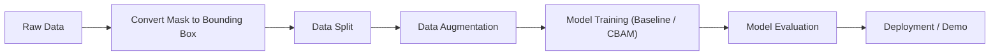

# AGENT CONTEXT — KLCN-2026
## YOLO11n + CBAM · MVTec AD Defect Detection

> **Mục đích:** File này là context cốt lõi cho AI Agent. Đọc file này ĐẦU TIÊN mỗi session để hiểu trạng thái dự án, pipeline, và các quyết định kỹ thuật đã thực hiện.

---

## §1. Pipeline Overview



### Trạng thái Pipeline

| Giai đoạn | Trạng thái | Ghi chú |
|:---|:---:|:---|
| Raw MVTec AD download | ✅ | 15 categories, ảnh gốc trong `data/raw/` |
| Mask → BBox conversion | ✅ | Script: `src/data/mvtec_mask_to_yolo.py`, 48 defect types |
| CVAT Review (double-check bbox) | ✅ | 255 labels sửa bbox, 10 ảnh good→defect renamed |
| Data Split (supervised) | ✅ | 3 tỷ lệ: 80/10/10, 70/15/15, 60/20/20. Script: `src/data/split_data.py` |
| Data Augmentation | ✅ | Offline aug (Target 40/nhóm): `src/data/augment_offline.py`, zip: `mvtec_augmented.zip` |
| YOLO11n Baseline framework | ✅ | Script: `src/training/train_baseline.py`, YAML: `configs/models/yolo11n_baseline.yaml`, smoke test 1e PASS |
| CBAM module implementation | ✅ | `src/models/cbam.py` (Channel + Spatial Attention), Ultralytics hook, unit test PASS |
| YOLO11n+CBAM (Exp 1 Backbone) | ✅ | Script: `src/training/train_cbam.py`, YAML: `configs/models/yolo11n_cbam_backbone.yaml`, smoke test 1e PASS |
| Colab Distributed Training Guide | ✅ | Notebook: `notebooks/05_colab_testingNtraining_guide.ipynb` (kết nối Drive, save_period=1) |
| Evaluation & Ablation analysis | ✅ | Script: `src/evaluation/plot_comparison.py` (Learning curves, metrics bar, auto MD summary) |
| Testing 100e (Ablation 5 mô hình) | ✅ | Hoàn tất 5 mô hình: Exp 3 (Neck+Head) đạt mAP50 67.06% (+5.62%), Recall 66.01% (+7.53%) |
| Web Demo (Streamlit) | 🔲 | Sẽ thực hiện dựa trên trọng số tốt nhất của Exp 3 (Neck+Head) |

---

## §2. MVTec AD Dataset

### Tổng quan
- **Nguồn:** MVTec Anomaly Detection Dataset (Bergmann et al., CVPR 2019)
- **Tổng ảnh:** 5,354 ảnh độ phân giải cao
- **Categories:** 15 (5 texture + 10 object)
- **Defect types:** 48 loại khuyết tật (sau khi convert mask → bbox)
- **Đặc thù quan trọng:**
  - Dataset gốc: train = chỉ ảnh normal, test = ảnh lỗi → **cần thiết kế lại giao thức supervised**
  - Khuyết tật: kích thước nhỏ, tương phản thấp, hình dạng bất quy tắc
  - Class imbalance nghiêm trọng: class ít nhất 8 ảnh, class nhiều nhất 30+ ảnh defect

### 15 Categories

| Nhóm | Categories |
|:---|:---|
| **Texture (5)** | carpet, grid, leather, tile, wood |
| **Object (10)** | bottle, cable, capsule, hazelnut, metal_nut, pill, screw, toothbrush, transistor, zipper |

### Định dạng dữ liệu sau convert
- **Ảnh:** `.png` trong `data/processed/images/{train,val,test}/`
- **Labels:** `.txt` YOLO format: `<class_id> <cx> <cy> <w> <h>` (normalized)
- **Ảnh "good":** Label file rỗng (0 bytes) — đúng chuẩn YOLO
- **Class mapping:** `classes.txt` — 48 defect types, index 0-47

---

## §3. YOLO11n Architecture

### Cấu trúc 3 tầng

```
YOLO11n (nano, ~2.6M params)
├── Backbone (Feature Extraction)
│   ├── Conv (stride 2) × 2
│   ├── C3k2 blocks (×4) — CSP cải tiến, kernel nhỏ
│   ├── SPPF — Spatial Pyramid Pooling Fast
│   └── C2PSA — Cross-Stage Partial + Spatial Attention [CÓ SẴN]
│
├── Neck (Feature Fusion — PANet)
│   ├── FPN path (top-down): Upsample + Concat + C3k2
│   └── PAN path (bottom-up): Conv stride 2 + Concat + C3k2
│   → Tạo ra 3 nhánh đặc trưng đa tỷ lệ: P3, P4, P5
│
└── Head (Detection — Anchor-free)
    ├── Detect P3 — small objects (80×80 grid @ 640 input)
    ├── Detect P4 — medium objects (40×40 grid)
    └── Detect P5 — large objects (20×20 grid)
```

### Lưu ý về C2PSA có sẵn
- YOLO11n đã tích hợp module attention **C2PSA** ở cuối backbone (sau SPPF).
- C2PSA = self-attention đơn lẻ tại 1 vị trí cố định, chỉ có spatial attention.
- **CBAM bổ sung** cho C2PSA: thêm channel attention + áp dụng đa tỷ lệ (P3/P4/P5).
- Hai cơ chế KHÔNG trùng lặp mà bổ trợ nhau.

---

## §4. CBAM Integration — 4 Cấu hình Ablation

> **Nguồn:** Đề cương chi tiết (`docs/thesis/DeCuongChiTiet.md`) yêu cầu ablation theo 4 khối kiến trúc chính, mỗi cấu hình CBAM áp dụng đồng thời trên P3/P4/P5.

### CBAM Module
- **Channel Attention:** AvgPool + MaxPool → MLP → Sigmoid → nhân element-wise
- **Spatial Attention:** AvgPool + MaxPool (theo channel) → Conv 7×7 → Sigmoid → nhân element-wise
- **Flow:** F → Channel Attn → F' → Spatial Attn → F'' (giữ nguyên shape `B,C,H,W`)

### 4 Cấu hình

| Config | Vị trí | Mô tả |
|:---|:---|:---|
| **Exp 1: Backbone** | Sau C3k2 blocks ở P3, P4, P5 trong backbone | Lọc feature trước khi fusion, giữ chi tiết nhỏ |
| **Exp 2: Neck** | Sau C3k2 fusion blocks trong neck | Chọn lọc thông tin khi fuse low-level + high-level |
| **Exp 3: Backbone+Neck** | Cả backbone và neck | Tối đa hóa attention, cần theo dõi overfitting |
| **Exp 4: Head** | Trước detection heads P3/P4/P5 | Tập trung attention ngay trước dự đoán |

---

## §5. Key Decisions Log

| # | Ngày | Quyết định | Lý do | Người quyết định |
|:---|:---|:---|:---|:---|
| 1 | — | Chọn YOLO11n (nano) | Nhẹ nhất, phù hợp edge deployment, baseline rõ ràng | Theo đề cương |
| 2 | — | Ablation 4 configs (B/N/B+N/H) | Đề cương yêu cầu, xác định vị trí CBAM tối ưu | Theo đề cương |
| 3 | — | MVTec AD mask → bbox | Chuyển bài toán segmentation sang detection (YOLO) | Theo đề cương |
| 4 | — | Thiết kế lại supervised split | MVTec gốc chỉ train=normal, cần đảm bảo train có ảnh lỗi | Theo đề cương |
| 5 | — | Web demo bằng Streamlit | Đề cương yêu cầu ứng dụng web | Theo đề cương §7 |

---

## §6. References (Quick Access)

| Tài liệu | Đường dẫn |
|:---|:---|
| GitHub Repository | `https://github.com/mizzhau/yolo11n-cbam-mvtec-defect-detection.git` |
| Kiến trúc & Quy chuẩn dự án | `docs/ARCHITECTURE.md` |
| Khung kế hoạch dự phòng (Runbook) | `docs/RUNBOOK_TEMPLATE.md` |
| Đề cương chi tiết | `docs/thesis/DeCuongChiTiet.md` |
| Data pipeline protocol | `docs/protocols/1-giai_phap_data_pipeline_mvtec.md` |
| Augmentation guide | `docs/protocols/1.1-data_augmentation_guide.md` |
| Augmentation research | `docs/protocols/1.2-research_augmentation_training.md` |
| Ablation study protocol | `docs/protocols/2-ablation_study_yolov11_cbam.md` |
| Ablation study results | `docs/EXPERIMENTS.md` |
| Project Notes | `docs/notes/` |
| Custom Agent Skills | `my-skill/` |
| Mask→BBox script | `src/data/mvtec_mask_to_yolo.py` |
| BBox verification | `src/data/verify_yolo_boxes.py` |
| EDA notebook | `notebooks/01_eda_dataset.ipynb` |

---

## §7. Coding Directives (Ghi nhớ cho Agent)

- **Không comment vô ích, dài dòng:** Tuyệt đối không chèn comment tường thuật những việc hiển nhiên, không comment từng dòng.
- **Code clean & tối ưu cho reviewer:** Tên biến/hàm tự tường minh (self-documenting), logic gọn gàng, súc tích, chỉ comment khi xử lý logic/công thức đặc thù phức tạp.
- **Không tự ý tạo code/script cho thao tác thủ công:** Đối với các tác vụ người dùng có thể làm nhanh bằng chuột phải/UI (nén zip/7z, chia nhỏ archive bằng WinRAR/7-Zip, tạo folder, upload Drive, xóa file...), không được viết script Python dư thừa; chỉ cần hướng dẫn các bước thao tác thủ công rõ ràng.
- **Quy tắc Git Commit & Push:** Tuyệt đối không tự ý commit/push lên Git repo khi chưa liệt kê rõ ràng danh sách các file sẽ đẩy lên và chưa nhận được sự xác nhận đồng ý từ người dùng. Nếu có yêu cầu chỉnh sửa, phải cập nhật và tiếp tục chờ người dùng duyệt mới được phép push.


